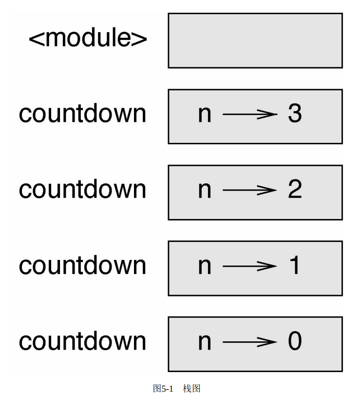

要跟踪哪些变量在哪些地方使用，有时候画一个栈图（stack diagram）会很方便。
和状态图一样，栈图可以展示每个变量的值，不同的是它会展示每个变量所属的函数。
每个函数使用一个帧包含，帧在栈图中就是一个带着函数名称的盒子，里面有函数的参数和变量。
def countdown(n):
    if n <= 0:
        print('blastoff!')
    else:
        print(n)
        countdown(n - 1)

